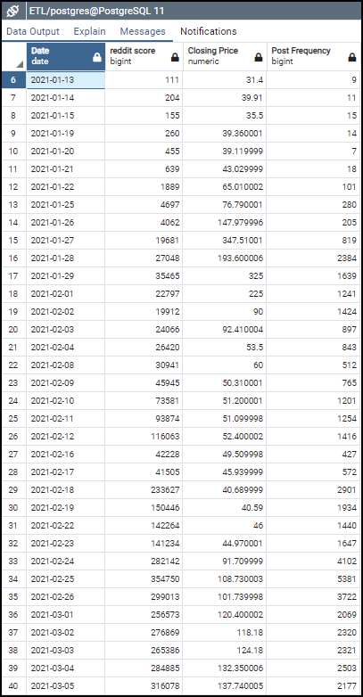

# wallstreetbETL

For this project, we chose to gather data related to the subreddit wallstreetbets and GME stock (Gamestop) phenomenon in February.  Our ETL process was to:

## Extract

Original data sources: stock prices from yahoo and scraped reddit posts from our friends of Kaggle.

|Data|Source|Date retrieved|File type|
|---|---|---|---|
|GME Stock prices 3/18/20-3/18/21|[Yahoo finance](https://finance.yahoo.com/quote/GME/history?p=GME) historical reports|3/18/21|csv|
|AMC Stock prices 3/18/20-3/18/21|Yahoo finance historical reports|3/18/21|csv|
|NYSE Stock prices 3/18/20-3/18/21|Yahoo finance historical reports|3/18/21|csv|
|NASDAQ Stock prices 3/18/20-3/18/21|Yahoo finance historical reports|3/18/21|csv|
|S&P 500 Stock prices 3/18/20-3/18/21|Yahoo finance historical reports|3/18/21|csv|
|IWC* Penny Stock Index 3/18/20-3/18/21|Yahoo finance historical reports|3/18/21|csv|
|r/wallstreetbets* posts 01/21-03/21|[Kaggle](https://www.kaggle.com/leukipp/reddit-finance-data)|3/18/21|csv|
|r/gme|[Kaggle](https://www.kaggle.com/leukipp/reddit-finance-data)|3/18/21|csv|
|r/stocks*|[Kaggle](https://www.kaggle.com/leukipp/reddit-finance-data)|3/18/21|csv|
|r/pennystocks*|[Kaggle](https://www.kaggle.com/leukipp/reddit-finance-data)|3/18/21|csv|
|r/robinhood*|[Kaggle](https://www.kaggle.com/leukipp/reddit-finance-data)|3/18/21|csv|

*Due to time constraints, we did not include these datasets.  But they would be interesting additions to the database.

## Transform:

### Data Cleaning: 
The reddit post dataset summarizing posts from r/gme proved the most challenging to clean, due to inclusion of emojis, quotation marks, and commas embedded within column data that created errors on PostgreSQL import.  Faulty CSV encoding from either the original dataset or the original Pandas export created import issues as well.  After the original data was reviewed via Pandas, and custom dataframes were created for our end goal, we resolved by stating explicitly the “'utf-8-sig” encoding for support of unconventional characters.  We also utilized manual cleaning in Excel to find and remove the commas and quotations within the “Post Title” Column to mitigate various import errors.

### Selection: 
We retained all information on  stock data, which is the standard one entry per day; open, high, low, close, and volume.  From the reddit data set, we retained date, post id, title of post, and the post’s score.

### Joining: 
We joined r/gme posts and the GME stock data for on date in order to correlate reddit posting activity with GME stock price.

## Load: 
Our final product is a local relational database which will allows exploration of the relationship between reddit activity and the stock market.  Here’s a screenshot of the result of one query we ran:

Note the dramatic rise in stock price in late January that lines up with the explosion of posts on the Gamestock reddit channel.  Interestingly, as the price dropped in early February, reddit posting activity remained high, which does lead in to another rise in stock price in late February.
